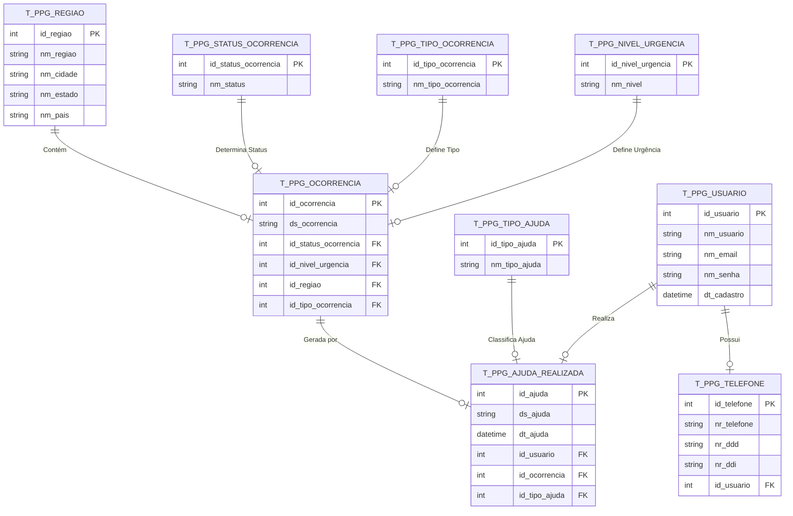

# 🌐 **RedePapagaio: Sistema de Controle de Desastres Naturais**

## 📌 Visão Geral

O **RedePapagaio** é um sistema desenvolvido para o controle de ocorrências de desastres naturais, gerenciamento de ajuda realizada por usuários e conexão entre ONGs, voluntários e regiões afetadas.  
A API RESTful foi construída com **.NET 8** e utiliza **Oracle Database**, prezando pela **escalabilidade** e **usabilidade** em cenários emergenciais.

---

## 🧰 Tecnologias Utilizadas

- ✅ **Backend**: .NET 8 (C#)  
- ✅ **Banco de Dados**: Oracle Database  
- ✅ **ORM**: Entity Framework Core  
- ✅ **Documentação da API**: Swagger  

---

## 📐 Diagramas

### 🧩 Diagrama Relacional (Mermaid)

> Representação das entidades, atributos e seus relacionamentos no banco de dados:



---

## 🧱 Estrutura do Projeto

- O projeto segue o padrão de arquitetura **MVC (Model-View-Controller)**.
- Utiliza o **Entity Framework Core** para manipulação dos dados no Oracle.
- Cada recurso da API é acessado via **HTTP Requests**.
- A documentação das rotas é gerada automaticamente via **Swagger**.

---

## ⚙️ Configuração do Banco de Dados

> Exemplo do arquivo `appsettings.json` com a string de conexão:

```json
{
  "ConnectionStrings": {
    "DefaultConnection": "User Id=<SEU_USUARIO>;Password=<SUA_SENHA>;Data Source=<SEU_SERVIDOR>:<PORTA>/<SERVICO>"
  },
  "Logging": {
    "LogLevel": {
      "Default": "Information",
      "Microsoft.AspNetCore": "Warning"
    }
  },
  "AllowedHosts": "*"
}
```

> 🔐 **Atenção**: Lembre-se de substituir `<SEU_USUARIO>`, `<SUA_SENHA>`, `<SEU_SERVIDOR>`, `<PORTA>` e `<SERVICO>` com os dados reais.

---

## 🚀 Instruções de Execução

### 1. Clone o repositório

```bash
git clone https://github.com/username/redepapagaio.git
cd redepapagaio
```

### 2. Restaure as dependências

```bash
dotnet restore
```

### 3. Compile o projeto

```bash
dotnet build
```

### 4. Execute a aplicação

```bash
dotnet run
```

---

## 🌍 Acesso ao Swagger

- Após rodar a aplicação, acesse:  
  👉 [http://localhost:5169](http://localhost:5169)  
- A interface do Swagger será exibida, permitindo testar todas as rotas da API de forma visual e interativa.

---

## Testes

---

### Regiao


