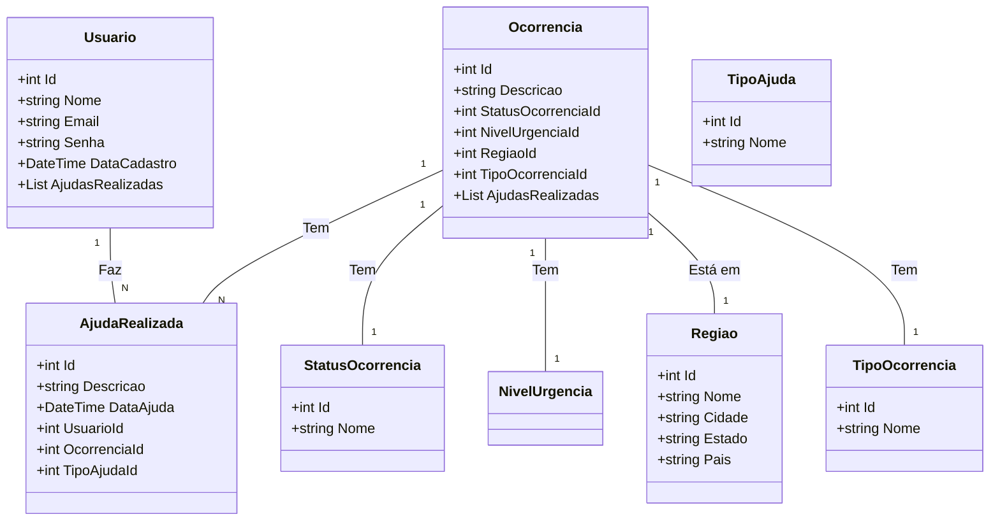

# **RedePapagaio: Sistema de Controle de Desastres Naturais**

## **Visão Geral**

O **RedePapagaio** é um sistema desenvolvido para o controle de ocorrências de desastres naturais, gerenciar a ajuda realizada pelos usuários e conectar ONGs e voluntários a regiões afetadas. O sistema possui uma API RESTful, projetada com **.NET 8** e utiliza **Oracle** como banco de dados. O projeto foi desenvolvido com ênfase na escalabilidade e usabilidade para cenários de desastres.

---

## **Tecnologias Utilizadas**

- **Backend**: .NET 8 (C#)
- **Banco de Dados**: Oracle Database
- **ORM**: Entity Framework Core
- **API Documentation**: Swagger
- **Injeção de Dependência**: ASP.NET Core DI
- **Testes**: XUnit (Testes Unitários)

---

## **Arquitetura do Sistema**

O sistema é composto por várias entidades inter-relacionadas, como **Usuário**, **Ocorrência**, **AjudaRealizada**, **Região**, **TipoOcorrencia** e **StatusOcorrencia**. Cada entidade possui relacionamentos de 1:N ou N:M com outras entidades, conforme a lógica do sistema.

### **Diagramas**

Aqui estão os diagramas que ilustram a arquitetura do sistema:

#### Diagrama de Classes

---

###Desenvolvimento

O projeto segue a arquitetura MVC (Model-View-Controller) e utiliza o Entity Framework Core para a manipulação dos dados no banco Oracle. Cada recurso da API é acessado via HTTP Requests, e o Swagger é utilizado para documentar as rotas.

---

###Configuração de banco de dados.

{
    "ConnectionStrings": {
      "DefaultConnection": "User Id=<SEU_USUARIO>;Password=<SUA_SENHA>;Data Source=<SEU_SERVIDOR>:<PORTA>/<SERVICO>"
    },
      "Logging": {
          "LogLevel": {
              "Default": "Information",
              "Microsoft.AspNetCore": "Warning"
          }
      },
      "AllowedHosts": "*"
}

###Instruções de Execução
Baixar o Repositório

Faça o clone do repositório:

git clone https://github.com/username/redepapagaio.git
cd redepapagaio
Restaurar Dependências

Execute o comando para restaurar as dependências:

dotnet restore
Compilar o Projeto

Para compilar o projeto, execute:

dotnet build
Executar o Projeto

Para rodar a aplicação, execute:

dotnet run
Acessar o Swagger

Abra o navegador e vá até http://localhost:5169, onde você verá a interface do Swagger. A partir daí, você pode testar as rotas da API diretamente.

###Testes
